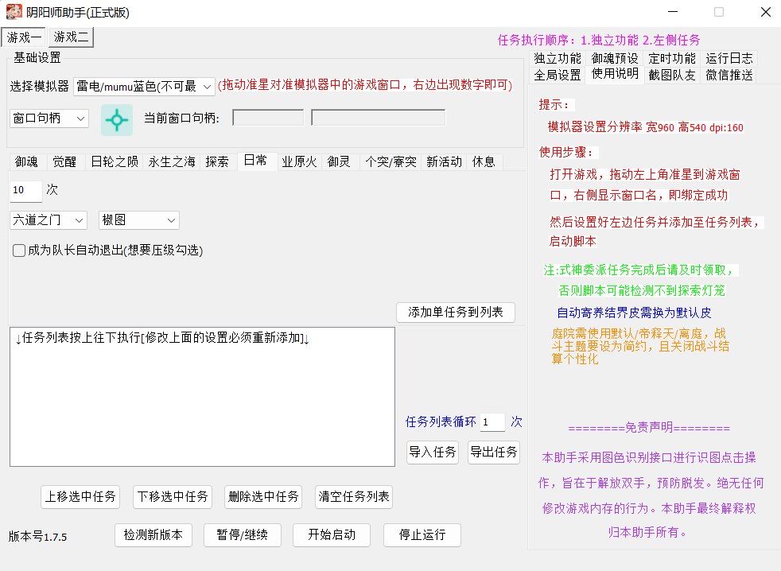
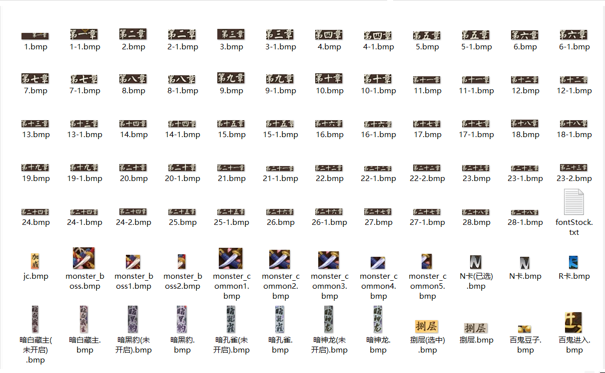
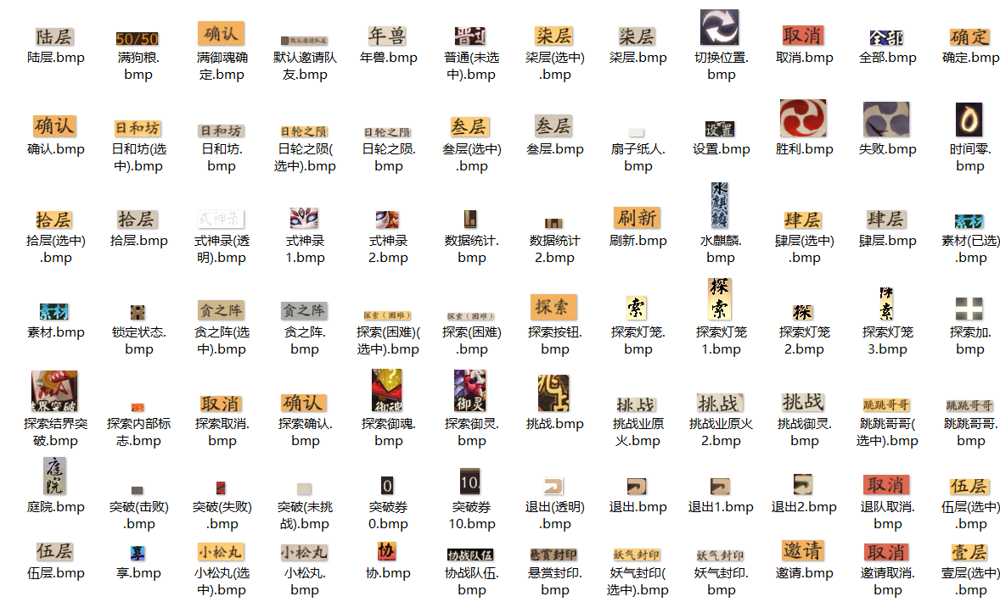
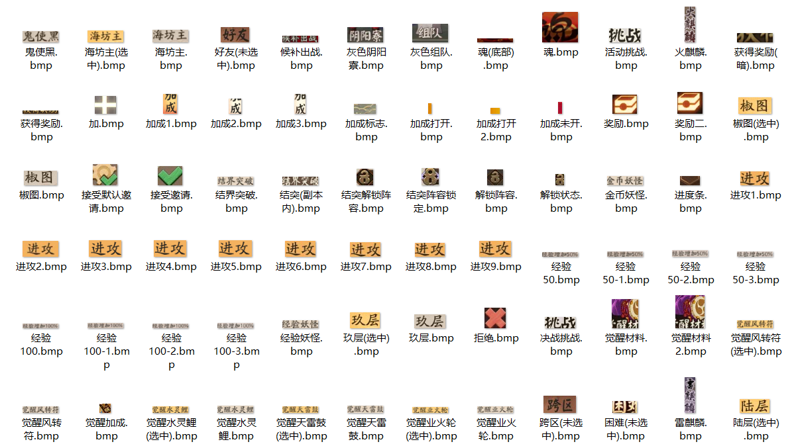

# YYS_ASSIST

一个神奇的痒痒鼠图色识别助手

简单、轻便、解放双手
稳定、高效率
众多功能等你探索

#### 使用文档：[点我查看](http://doc.sakurabot.com/)
#### 运行视频：[点我查看](http://www.sakurayys.cn/)
# 一、使用作者打包好的exe

# 二、自己编译运行
##### 1.下载源码或者通过git拉取，使用VS2017及以上版本（最好是2017）打开项目，修改YYS_AssistDlg.cpp中的大漠插件注册（有相应注释），找到代码g_dm->Reg(_T(""),_T(""));在两个_T("")中填入自己买的或找的大漠注册码和附加码。
##### 2.使用大漠图色工具（百度一大堆分享的）自己截取游戏不同场景的图片（应该挺多的，可能会有亿点点工作量哈，不想截图就用现成的exe支持一下作者哟§(*￣▽￣*)§）放在项目的pic_font文件夹（桌面端也适用，不过得自己在代码中调各个场景识别范围），
#####   模拟器默认分辨率[960*540 160dpi](照着这个分辨率只需截图，不用考虑识别区域坐标)
##### 3.将项目解决方案配置改为debug或release  解决方案平台选x86  （注意：必须为x86,大漠64位需自己定制）
##### 4.CTRL + F5即可开始运行脚本
# 三、主要开发文档见文件夹：主要接口介绍文档->接口介绍.cpp
# 四、QQ交流群：462947796
# 五、自己截图说明
# 百度上可以搜到大漠综合工具，使用此工具抓图保存(需为bmp格式)，下面是抓的图示例。

