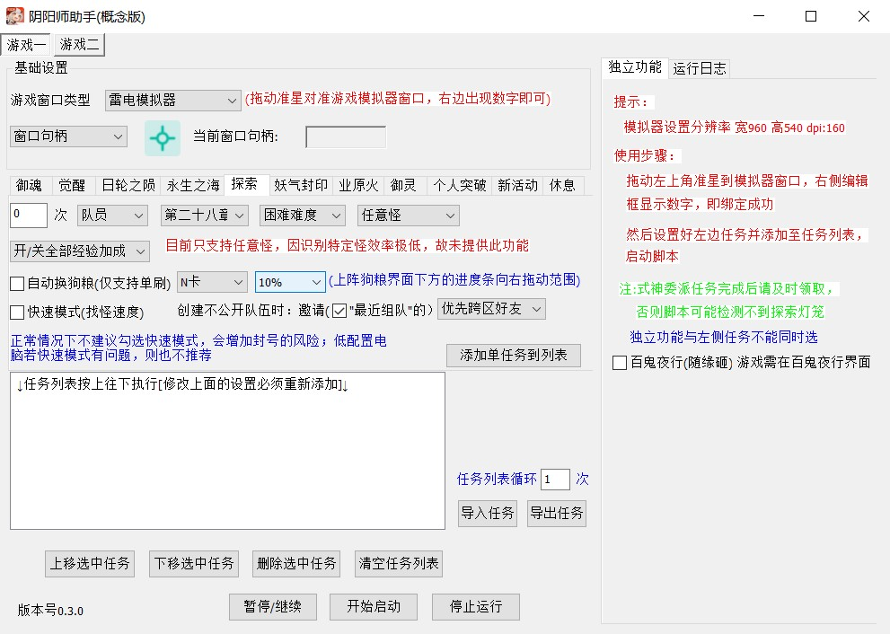
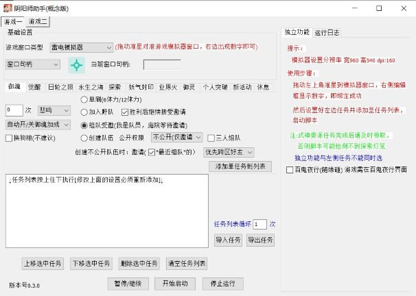
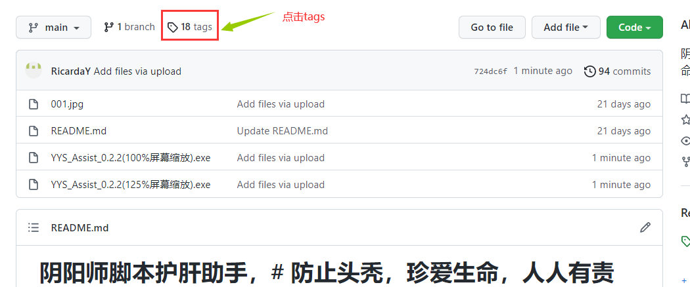
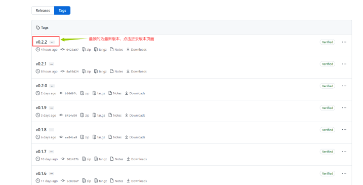
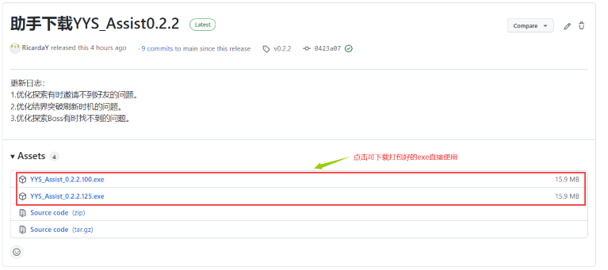

# YYS_ASSIST
## 阴阳师脚本护肝助手，防止头秃，珍爱生命，人人有责
#### 基于C++结合MFC开发的阴阳师辅助，结合大漠插件的图色识别函数，进行模拟人手点击操作，脚本中使用大量的随机延迟函数和随即延迟点击，并且游戏是在模拟器中运行，脚本在电脑环境运行，环境分离，只要操作得当，让脚本的行为像人一样，被检测到的几率几乎为0.
###### 脚本示意图

# 一、简单的使用方法 
###### ①点击左上角tags

###### ②选择一个发行版本进入下载相应exe

###### ③选择对应屏幕缩放(100%或125%)的脚本下载即可(不同缩放的脚本只是显示效果不同，功能无任何区别)

